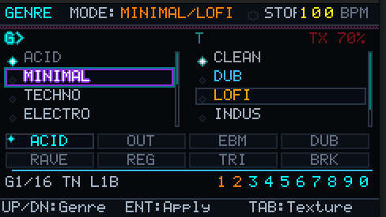
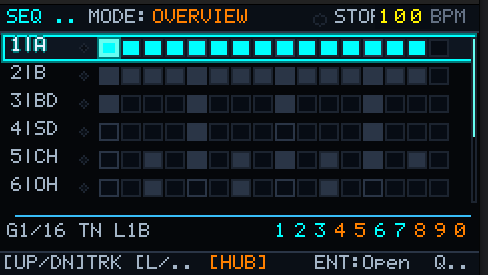
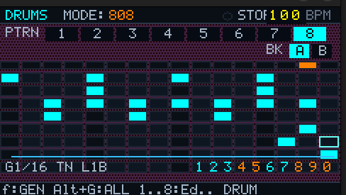
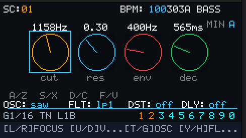
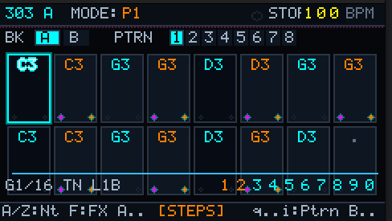
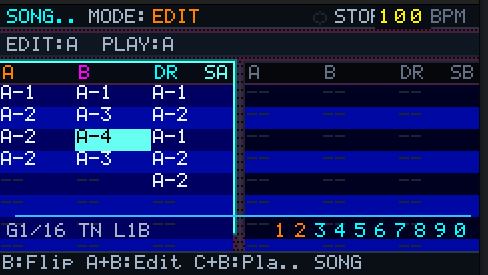
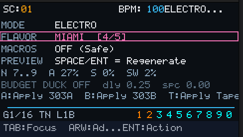

# GroovePuter

[](#status)
[-blue)](#requirements)
[](#build--flash)

> **Portable real-time groove computer for M5Stack Cardputer.**
> A **time-feel engine** that separates **what** is generated from **how it feels in time** and **how it sounds right now**.

Based on the original **MiniAcid** by [urtubia/miniacid](https://github.com/urtubia/miniacid) — this fork focuses on **timing FEEL**, **scene persistence**.


## Status

**Beta.** Core flow is playable and stable on device. APIs/UI may change as the instrument evolves.

## Features

* **Two Swappable Synth Voices:** swap engines on the fly (click-free) between TB-303, OPL2 (FM), AY/YM2149 (PSG), and SID.
* **TR-808–inspired drum section**
* **Pattern + song arrangement**
* **Dual song slots (`A/B`)** with split compare and live mix controls
* **RETRO split Song view** aligned with cyber theme styling
* **FEEL system (live):**
  * Grid: `1/8 · 1/16 · 1/32`
  * Timebase: `HALF · NORMAL · DOUBLE`
  * Length: `1B … 8B` (cycle length)
* **TEXTURE layer (live):** Lo-Fi / Drive / Drum FX (Comp, Transient, Reverb)
* **MIDI Routing:** Interactive grid for mapping MIDI channels to instruments
* **Genre-driven generator:** rhythmic masks, motif length, scale preference, density traits
* **Groove Lab page:** mode/flavor/macros + corridor/budget preview
* **Drum Automation page:** 4 automation lanes + per-pattern groove override
* **Scene persistence:** safe load for older scenes (optional fields)


## Quick Keys 
- `Space`: play/stop
- `Fn+nums`: page routing
- `Arrows`: move cursor / navigate lists
- `Enter`: confirm/apply/toggle focused item
- `Tab`: switch focus/section on many pages
- `[` / `]`: previous/next page
- `Ctrl+[` / `Ctrl+]`: switch editing page context (Song Page)
- `Q..I`: choose pattern slot `1..8` in Pattern/Drum/Song contexts
- `B`: quick A/B bank toggle (Pattern/Drum) or bank flip in Song cell/selection
- `Alt+B`: edit song slot `A/B`
- `Ctrl+B`: play song slot `A/B`
- `X`: split compare (Song) or primary action on Tape page
- `Esc`: back (or clear selection in editors)

## Screenshots

| Page | Preview |
| :--- | :--- |
| **Genre** |  |
| **Sequencer Hub** |  |
| **Drum Section** |  |
| **Synth Params** |  |
| **Pattern Edit** |  |
| **Song Page** |  |
| **Groove Lab** |  |

## MIDI & Drums

### MIDI Matrix Routing
The `MidiAdvance` dialog now features a unified **Track Map** (4x4 grid). This allows you to import complex MIDI files and route multiple source channels to any internal track (`Synth A`, `Synth B`, `Drums`). 
- **Auto-Routing:** Smart detection scans track names for keywords like "bass" or "percussion" to pre-configure imports.
- **Smart Destination:** Automatically finds empty patterns for a seamless workflow.

### Advanced Drum FX
The drum section now includes a dedicated FX chain to ensure your percussion cuts through the mix:
- **One-Knob Compressor:** Parallel compression for punch and weight.
- **Transient Shaper:** Independent control over attack snap and sustain tail.
- **Drum Reverb:** Algorithmic reverb specifically tuned for percussion.

## Requirements

* **Hardware:** M5Stack Cardputer ADV (ESP32-S3)
* **Tooling:** `arduino-cli` (recommended) or Arduino IDE 2.x
* **ESP32 core:** `esp32:esp32`

## Build & Flash
### Recommended

```bash
# Build release
./release.sh

# Upload to device
./upload.sh /dev/ttyACM0
```

### Manual (arduino-cli)

```bash
arduino-cli compile \
  --fqbn esp32:esp32:esp32s3:CDCOnBoot=cdc

arduino-cli upload \
  --fqbn esp32:esp32:esp32s3:CDCOnBoot=cdc \
  -p /dev/ttyACM0
```


## Troubleshooting

### Upload fails / can’t connect

* Use a **data** USB cable (not charge-only)
* Confirm the port exists:

  ```bash
  ls /dev/tty* | head
  ```
* Confirm board detection:

  ```bash
  arduino-cli board list
  ```

### Audio crackle under heavy load

* This build uses **adaptive FX safety** (FX dries out briefly instead of crackling).
* If crackling persists: reduce FX intensity (Tape mix/feedback, delay mix), then re-test.


## Contributing

This is an **experimental instrument**. If you want to contribute:

* Keep PRs small and testable.
* Prefer changes that preserve the core rule: **GENRE ≠ FEEL ≠ GENERATOR ≠ TEXTURE**.
* If you’re unsure where a change belongs, open an issue first.


## Credits

* Original inspiration: [urtubia/miniacid](https://github.com/urtubia/miniacid)
* Hardware: M5Stack Cardputer
* References: TB-303 / TR-808 lineage 

## License

MIT (`LICENSE`)
