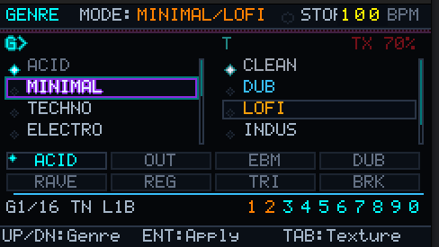
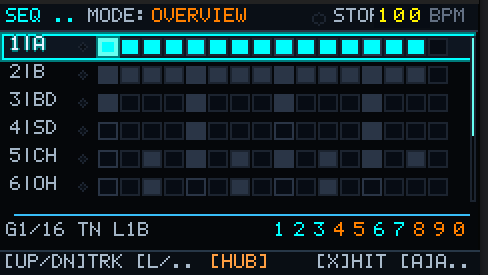
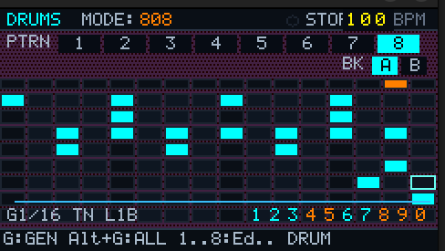
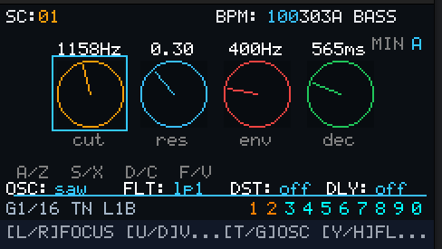
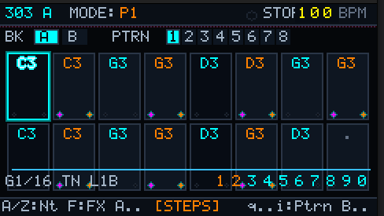
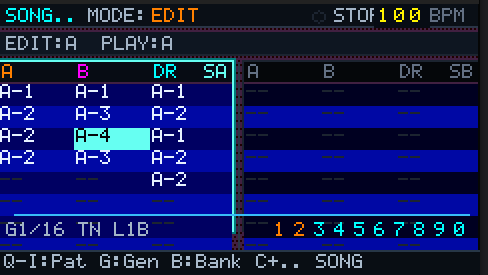

# GroovePuter v0.1.0

[](#status)
[](#requirements)
[](#build--flash)

> **Portable real-time groove computer for M5Stack Cardputer ADV.**
> A standalone groovebox that separates musical language, time feel,
> generated form, sound design, arrangement, performance, and MIDI routing.

Based on the original **MiniAcid** by [urtubia/miniacid](https://github.com/urtubia/miniacid). This fork focuses on generative patterns, timing FEEL, scene persistence, Song and Phrase arrangement, portable performance, and bounded MIDI integration.

## Status

**Beta.** The core groovebox, three-page GENERATE workflow, Song, Phrase Core, performance tools, USB-MIDI, and realtime SMF workflows are available on Cardputer ADV. APIs and UI may still change.

[`PLAN.md`](PLAN.md) remains the roadmap. This README describes behavior present in the current firmware and does not promote planned work to shipped behavior.

## Product model

GroovePuter is a standalone groovebox. Yamaha SEQTRAK and other MIDI devices are optional output targets, not runtime dependencies.

```text
GENRE != FEEL != GENERATION
```

The workflow map is:

```text
PERFORM:  MIDI KEYBOARD -> MIDI PLAYER
GENERATE: GENRE -> FEEL -> GENERATION
HUB:      OVERVIEW -> SYNTH A -> SYNTH B -> DRUMS -> SYNTH A SOUND -> SYNTH B SOUND
SONG:     SONG -> PHRASE CORE
SETTINGS: PROJECT / SETUP
```

```text
GroovePuter
├── two synth voices and a drum engine
├── independent GENRE / FEEL / GENERATION decisions
├── pattern, Song, and reference-backed Phrase arrangement
├── live performance keyboard and transport-synchronised performance tools
├── sample-timed USB-MIDI output and transport
└── realtime SMF playback, inspection, mute, and routing
```

Atlas remains an optional source of curated factory seed patterns.

## Features

### Sound and arrangement

* **Two swappable synth voices:** `TB303`, `SID`, `AY`, `SH101`, `SN76489`, and `WAVEMORPH`.
* **Legacy OPL2 scene compatibility:** the persisted OPL2 value is decode-only and falls back to `TB303`; OPL2 is not a selectable runtime engine.
* **TR-808-inspired drums** with automation, groove overrides, compression, transient shaping, and reverb.
* **Pattern and Song arrangement** with Song slots `A/B`, split compare, live mix, reverse/loop controls, markers, and block copy/paste.
* **Phrase Core** with four fixed slots `A/B/C/D`, lengths `1/2/4/8` bars, roles, derivation, Scene persistence, and atomic write-to-Song commands.
* **Honest Phrase storage:** `REFERENCE VIEW / REF MUTABLE`. Phrase slots store bounded references to existing patterns; they do not own copied note events.

### Three-page GENERATE workflow

The pages have separate ownership:

1. **GENRE** — musical corridor, vocabulary, recipe, and explicit materialization policy.
2. **FEEL** — swing, timing humanization, and velocity humanization only.
3. **GENERATION** — bounded form/materialization into the selected Song row.

Sound design is edited through the synth, Tape and FX controls that own the persisted DSP parameters. There is no separate runtime TEXTURE axis.

The causal order is fixed:

```text
GENRE -> FEEL -> GENERATION
```

Changing one page must not silently mutate another page. Page-aware `Alt+H` states the ownership and non-scope of each page.

### Phrase Core

Phrase Core is the second page in the SONG workflow.

| Key | Action |
|---|---|
| `1..4` | Select Phrase `A/B/C/D` |
| `Up/Down` | Select capture length `1/2/4/8` bars |
| `Left/Right` | Preview a saved Phrase bar |
| `R` | Cycle role |
| `P` | Select derive parent |
| `Enter` | Capture the current Song region as references |
| `D` | Derive the selected parent into the selected slot |
| `W` | Write to an empty Song destination |
| `Alt+W` | Explicit overwrite path |
| `Backspace` | Clear the selected Phrase slot |
| `Alt+H` | Open Phrase-aware help |

A referenced pattern edit changes the Phrase material and preview after the Scene revision changes. Save/load preserves valid slots and cleared slots.

### PERFORMANCE TOOLS

Open the PERFORM tools layer with `Tab`.

| Key | Tool |
|---|---|
| `1` | ARPEGGIATOR |
| `2` | DIRECTION |
| `3` | CHORD |
| `4` | MEMORY |
| `5` | STRUM |
| `6` | RATCHET |
| `7` | EUCLIDEAN |
| `8` | ROTATE |

`Shift+1..8` cycles adjustable tools backward. Direct NOTE input remains playable while transport runs. Step-based tools follow the coherent project transport timeline and use the existing event router and MIDI dispatcher; they do not create a second scheduler or USB writer.

### Song Generate

Song pattern references and pattern content are distinct.

| Key | Song action |
|---|---|
| `Q..I` | Assign an existing pattern slot `1..8` without regeneration |
| `G` | Generate material into a safe free slot, then assign the selected Song cell |
| double-tap `G` | Materialize Synth A, Synth B, and Drums for the current Song row as one logical mutation |

Generation is copy-on-write. It never silently overwrites a pattern referenced by another Song cell. If no safe slot is available, `NO EMPTY PATTERN SLOTS` is shown and Scene data is unchanged.

### MIDI Player and HUB MIDI

The realtime SMF workflow includes:

* physical-track mute mixer (`U`) and direct physical-track mute hotkeys `1..9`;
* channel inspector (`I`), structural inspector (`S`), and performance panel (`D`);
* Player -> HUB MIDI navigation with `H` after a file is loaded;
* return from HUB MIDI with `H` or `Esc`, preserving the loaded-file session and panel state;
* per-physical-track route override in HUB MIDI: `AUTO` or `CH1..CH10`;
* bounded route profiles restore `AUTO` / `CH1..CH10` assignments across reloads and reboots when file identity still matches.

SEQTRAK-safe routing maps drums to `CH1..CH7`, Synth 1 to `CH8`, Synth 2 to `CH9`, and DX to `CH10`. RAW routing passes source channels through. HUB MIDI does not own SMF transport, scheduling, TinyUSB writes, or note lifecycle.

### Persistence and UI

* Scene Save/Load persists supported patterns, Song references, Phrase Core state, synth/drum state, and scene codec fields.
* UI session persistence stores the active page, last page in each workflow, master volume, visual style, and waveform-overlay state.
* The current page map has **14 pages**: three GENERATE pages, two SONG pages, and one SETTINGS page.
* The public theme cycle is `CARBON <-> CYBER`. `AMBER` remains a persisted compatibility style.

## Controls

### Global navigation

| Key | Action |
|---|---|
| `Alt+H` | Open page-aware help for the active screen |
| `Fn+M` | Open the workspace launcher |
| `Fn+Tab` / `Fn+Shift+Tab` | Cycle workflow forward / backward |
| `[` / `]` | Previous / next page inside the current workflow |
| `Fn+[` / `Fn+]` | Previous / next workflow |
| `Alt+[` / `Alt+]` | Previous / next detailed page |
| `Alt/Fn+1..0` | Direct page jump |
| `Space` | Active transport; the active page gets first refusal |
| `Alt+P` | Open MIDI Player |
| `Alt+V` | Open the first GENERATE page |
| `Alt+W` | Toggle waveform overlay except where Phrase owns explicit overwrite |
| `Alt+X` | Toggle LiveMix |
| `Alt+M` | Toggle Song mode |
| `Alt+\` | Toggle `CARBON <-> CYBER` |
| `1..0` | Track-mute fallback when the active page does not consume the digit |
| `Esc` / `Backspace` / `` ` `` | Back, dismiss, or return to the previous page |
| `Ctrl+Alt+Backspace` | Release active notes and reset the project |

The active page receives keys before global fallbacks. This prevents page-local commands, NOTE mode, Song assignment, Phrase overwrite, and MIDI mute controls from colliding.

### PERFORM

`NOTE MODE: ON` is the default after reboot.

* `QWERTYUIOP` is the upper scale-aware manual.
* `ASDFGHJKL` is the lower manual, one octave below.
* `\` cycles the internal/USB synth, DX, and drum targets.
* `,` / `.` select scale; `-` / `=` shift octave; `X` sends target-scoped panic.
* `Tab` opens PERFORMANCE TOOLS.

The canonical page-by-page key reference is [`src/ui/docs/keys.md`](src/ui/docs/keys.md).

## Screenshots

The previews below use the current `CYBER` UI. Their footer hints are the same primary controls shown by `Alt+H`; the overlay also lists secondary commands that do not fit in the 240x135 footer.

| Firmware screen | Preview |
|:---|:---|
| **GENRE** |  |
| **OVERVIEW / SEQUENCER HUB** |  |
| **DRUMS** |  |
| **SYNTH A SOUND** |  |
| **SYNTH A PATTERN** |  |
| **SONG** |  |

## MIDI ownership

Accepted live, Pattern, Song, Phrase-write, transport, and realtime SMF events converge on the existing event router and sample-timed USB-MIDI dispatcher. The dispatcher remains the sole TinyUSB MIDI writer. New pages and tools must not add parallel schedulers or direct `tud_midi_*` calls.

## Requirements

* **Hardware:** M5Stack Cardputer ADV with ESP32-S3FN8.
* **Memory profile:** PSRAM disabled.
* **Tooling:** `arduino-cli` and dependencies pinned by `scripts/install_arduino_deps.sh`.
* **Normal profile:** USB MIDI plus CDC Serial, built by `scripts/build.sh`.
* **MIDI-only profile:** class-compliant USB MIDI without CDC, built by `scripts/build_seqtrak_midi_only.sh`.
* **Partition:** `huge_app` as set by the build scripts.

Fixed-DRAM checks are regression gates against the repository budget. Hardware acceptance and runtime telemetry remain required.

## Build & Flash

```bash
bash scripts/install_arduino_deps.sh
bash tests/run_host_tests.sh
bash scripts/build.sh --warnings all
bash scripts/check_cardputer_dram_budget.sh \
  build/cardputer-adv-current/GroovePuter.ino.elf
bash scripts/upload.sh /dev/ttyACM0
arduino-cli monitor -p /dev/ttyACM0 -c baudrate=115200
```

MIDI-only build:

```bash
bash scripts/build_seqtrak_midi_only.sh --warnings all
```

No external wiring is required. The firmware uses the built-in screen, keyboard, ES8311 audio codec, speaker/headphone output, and USB-C for flashing, Serial, and USB MIDI.

The integrated hardware checklist is [`docs/stages/INTEGRATED_GENERATE_PHRASE_ACCEPTANCE.md`](docs/stages/INTEGRATED_GENERATE_PHRASE_ACCEPTANCE.md).

## Troubleshooting

### Upload fails

Use a data-capable USB cable and confirm the port:

```bash
arduino-cli board list
```

### Song generation shows `NO EMPTY PATTERN SLOTS`

No pattern or Song reference was changed. Clear an unused pattern slot that is not referenced by Song A or Song B, or switch to another pattern page/bank and retry.

### Phrase preview looks stale

Commit the pattern edit so the Scene revision changes, then return to Phrase Core. The preview must update without recapturing. A stale preview after a revision change is a failure.

### Audio crackle or hangs under load

Reduce Tape/delay intensity and monitor `[PERF]`. `underruns` must not grow continuously during ordinary playback and navigation.

## Contributing

* Read [`PLAN.md`](PLAN.md) before proposing a feature lane.
* Keep PRs narrow and testable.
* Preserve **GENRE != FEEL != GENERATION != TEXTURE**.
* Preserve `REFERENCE VIEW / REF MUTABLE` until an explicit owned-event design is accepted.
* Preserve standalone groovebox behavior and the existing transport/MIDI owners.

## Credits

* Original inspiration: [urtubia/miniacid](https://github.com/urtubia/miniacid)
* Hardware: M5Stack Cardputer ADV
* References: TB-303 / TR-808 lineage

## License

MIT (`LICENSE`)
