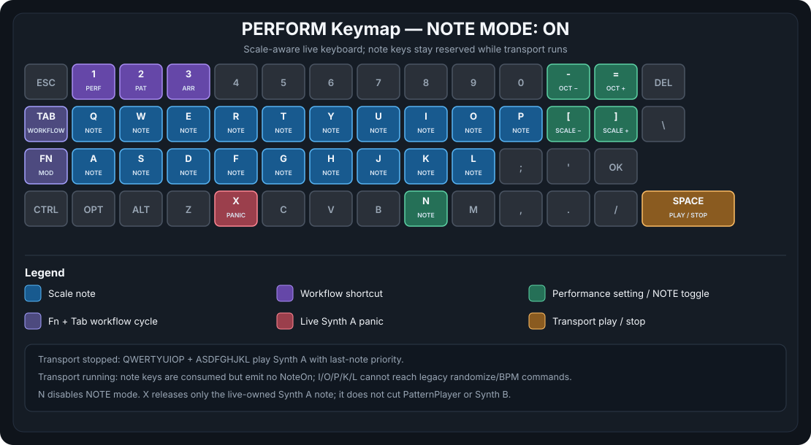
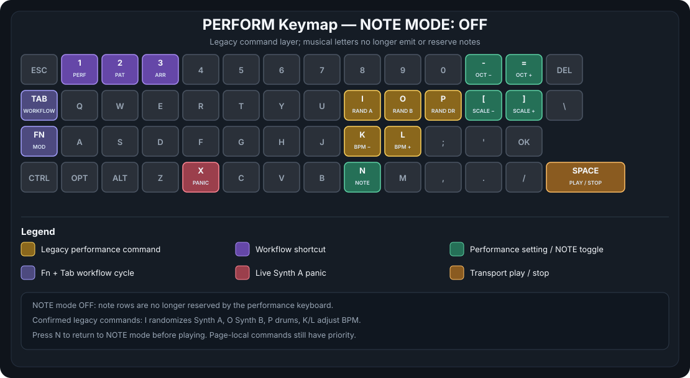
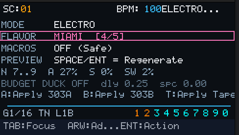

# GroovePuter v0.1.0

[](#status)
[](#requirements)
[](#build--flash)

> **Portable real-time groove computer for M5Stack Cardputer.**
> A **time-feel instrument** that separates the musical language, generated material, movement in time, and current sound.

Based on the original **MiniAcid** by [urtubia/miniacid](https://github.com/urtubia/miniacid). This fork focuses on generative patterns, timing FEEL, scene persistence, arrangement, portable performance, and bounded MIDI integration.

## Status

**Beta.** Core groovebox flow is playable on Cardputer-ADV. APIs/UI may change as the instrument evolves.

The canonical product direction and execution order are documented in [`PLAN.md`](PLAN.md). This README describes capabilities available on the current branch; it does not establish a separate roadmap.

## Product model

GroovePuter remains a self-contained groovebox. External instruments such as Yamaha SEQTRAK are supported output targets, not required dependencies.

The core product invariant is:

```text
GENRE != FEEL != GENERATOR != TEXTURE
```

```text
GroovePuter
├── generators, patterns, synths and drums
├── independent GENRE / FEEL / GENERATOR / TEXTURE decisions
├── pattern and song arrangement
├── live NOTE mode for internal Synth A
├── sample-timed USB-MIDI output and transport
└── realtime SMF playback and routing
```

The long-term musical hierarchy is:

```text
step -> bar -> phrase -> section -> song
```

The active implementation order, acceptance metrics, memory constraints, and deferred ideas live in [`PLAN.md`](PLAN.md).

Atlas remains an optional source of curated factory seed patterns.

## Features

* **Two Swappable Synth Voices:** TB-303, OPL2 (FM), AY/YM2149 (PSG), and SID.
* **TR-808–inspired drum section.**
* **Pattern + song arrangement.**
* **Additive PERFORM page:** scale-aware two-row keyboard, explicit NOTE mode, monophonic last-note priority, and transport-safe Synth A ownership.
* **PERFORM / PATTERN / ARRANGE shortcuts** over the unchanged detailed page carousel.
* **Dual song slots (`A/B`)** with split compare and live mix controls.
* **RETRO split Song view** aligned with cyber theme styling.
* **FEEL system (live):**
  * Grid: `1/8 · 1/16 · 1/32`
  * Timebase: `HALF · NORMAL · DOUBLE`
  * Length: `1B … 8B`
* **TEXTURE layer (live):** Lo-Fi / Drive / Drum FX.
* **Genre-driven generator:** rhythmic masks, motif length, scale preference, and density traits.
* **Groove Lab page:** mode/flavor/macros + corridor/budget preview.
* **Drum Automation page:** four automation lanes + per-pattern groove override.
* **Scene persistence:** safe load for older scenes.
* **USB-MIDI output:** sample-timed Pattern and live event dispatch through one TinyUSB owner.
* **MIDI transport:** Clock, Start, Stop, and lifecycle work on the `dev` line.
* **Realtime SMF player:** file playback, routing modes, track selection/mute work, and project timing modes.

## Controls

### Groovebox navigation

The firmware starts on the original **Genre** page. All existing pages remain available.

| Key | Action |
|---|---|
| `[` / `]` | Previous / next page in the complete GroovePuter carousel |
| `Fn + 1..0` | Direct jump to detailed pages `1..10` |
| `Fn + Tab` | Cycle the high-level `PERFORM → PATTERN → ARRANGE` shortcuts |
| `Fn + Shift + Tab` | Cycle those shortcuts backward |
| `Space` | Transport play / stop |
| `Esc` | Back or dismiss |

`PERFORM / PATTERN / ARRANGE` does not remove or replace the original pages. It is only a faster way to reach three common working contexts.

### PERFORM — NOTE MODE: ON



`NOTE MODE: ON` is the default when PERFORM is opened after reboot.

* `QWERTYUIOP` is the upper scale-aware manual.
* `ASDFGHJKL` is the lower scale-aware manual.
* The upper row is exactly one octave above the matching lower-row scale degree.
* Synth A is monophonic and uses last-note priority.
* While transport runs, note keys remain **reserved and consumed**, but emit no `NoteOn`.
* `X` releases only the live-owned Synth A note; it does not stop PatternPlayer or Synth B.

| Key | PERFORM action |
|---|---|
| `N` | NOTE mode ON / OFF |
| `,` / `.` | Previous / next scale |
| `-` / `=` | Octave down / up |
| `X` | Live Synth A panic |
| `1` / `2` / `3` | PERFORM / PATTERN / ARRANGE |

### PERFORM — NOTE MODE: OFF



`NOTE MODE: OFF` returns musical letters to the legacy command layer.

| Key | Legacy action |
|---|---|
| `I` | Randomize Synth A pattern |
| `O` | Randomize Synth B pattern |
| `P` | Randomize drums |
| `K` / `L` | BPM down / up |
| `N` | Return to NOTE mode |

> [!IMPORTANT]
> Page commands always get first refusal. NOTE mode receives an unmodified key only after the active page declines it. The step editor therefore keeps its own editing controls.

The current firmware may suppress live `NoteOn` while transport owns Synth A. Wave 1 in [`PLAN.md`](PLAN.md) requires the interface to expose the effective key state as `NOTE`, `CMD`, `LOCAL`, or `LOCK` before changing this ownership behavior.

### Editor conventions

| Key | Common action |
|---|---|
| `Arrows` | Move cursor or navigate lists |
| `Enter` | Confirm, apply, or toggle the focused item |
| `Tab` | Change focus or section on supported pages |
| `Q..I` | Pattern slots `1..8` in Pattern, Drum, and Song contexts |
| `1..9`, `0` | Track mutes when the active page does not consume the digit |

The canonical page-by-page reference is in [`src/ui/docs/keys.md`](src/ui/docs/keys.md). The Cardputer-ADV performance acceptance procedure is in [`docs/tests/PERFORMANCE_WORKFLOW_CARDPUTER_ADV.md`](docs/tests/PERFORMANCE_WORKFLOW_CARDPUTER_ADV.md).

## Screenshots

| Page | Preview |
| :--- | :--- |
| **Genre** |  |
| **Sequencer Hub** |  |
| **Drum Section** |  |
| **Synth Params** |  |
| **Pattern Edit** |  |
| **Song Page** |  |
| **Groove Lab** |  |

## MIDI & Drums

### USB-MIDI output

The `dev` line includes one sample-timed USB-MIDI dispatcher used by accepted live, Pattern, transport, and realtime SMF paths. The dispatcher remains the sole TinyUSB writer; new features must reuse it rather than add a parallel scheduler.

Current accepted direction includes:

```text
PERFORM Synth A / Synth B / DX / Drums
Pattern Synth A / Synth B / Drums
MIDI Clock / Start / Stop
realtime SMF playback and routing
```

Exact target routing and lifecycle acceptance are documented under `docs/stages/`. Hardware-dependent capabilities remain beta until their stage acceptance is complete.

### MIDI file routing

The SMF player routes complete MIDI files through the realtime output path. The `MidiAdvance` dialog also provides Track Map behavior for importing MIDI material into internal tracks (`Synth A`, `Synth B`, `Drums`). Playback/routing and import are separate workflows.

### Advanced Drum FX

* One-knob compressor.
* Transient shaper.
* Drum reverb.

## Requirements

* **Hardware:** M5Stack Cardputer ADV, ESP32-S3FN8, no PSRAM.
* **Tooling:** `arduino-cli`.
* **Board package:** pinned by `scripts/install_arduino_deps.sh`.
* **FQBN:** `m5stack:esp32:m5stack_cardputer:PSRAM=disabled,PartitionScheme=huge_app`.

## Build & Flash

```bash
bash scripts/install_arduino_deps.sh
bash scripts/build.sh --warnings all
bash scripts/upload.sh /dev/ttyACM0
arduino-cli monitor -p /dev/ttyACM0 -c baudrate=115200
```

No external wiring is required. The firmware uses the built-in keyboard, ES8311 codec, speaker/headphone output, and USB-C for flashing, Serial, and supported USB-MIDI operation.

## Troubleshooting

### Upload fails / cannot connect

* Use a data USB cable.
* Confirm the port exists:

  ```bash
  arduino-cli board list
  ```

### NOTE mode shows a MIDI note but produces no audio

Use a build containing the live-render fix after commit `61478ec4` or later. The synth render path must run while transport is stopped; older PR #5 builds displayed the note but gated voice rendering behind `playing`.

### Audio crackle under heavy load

Reduce Tape/delay intensity and monitor the existing `[PERF]` telemetry. `underruns` must not continually increase during ordinary play.

## Contributing

This is an experimental instrument.

* Read [`PLAN.md`](PLAN.md) before proposing a feature lane.
* Keep PRs small and testable.
* Preserve the core rule: **GENRE ≠ FEEL ≠ GENERATOR ≠ TEXTURE**.
* Keep GroovePuter usable as a standalone groovebox.
* Do not let an implementation stage silently reorder the canonical plan.

## Credits

* Original inspiration: [urtubia/miniacid](https://github.com/urtubia/miniacid)
* Hardware: M5Stack Cardputer ADV
* References: TB-303 / TR-808 lineage

## License

MIT (`LICENSE`)
