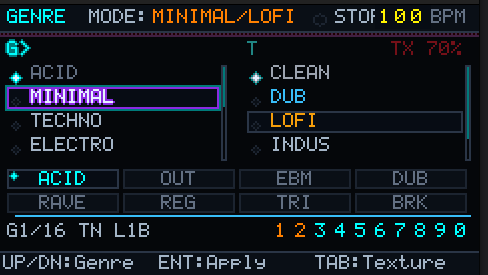
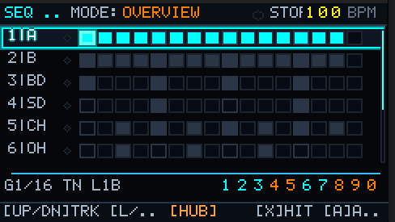
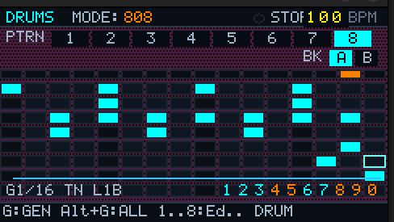
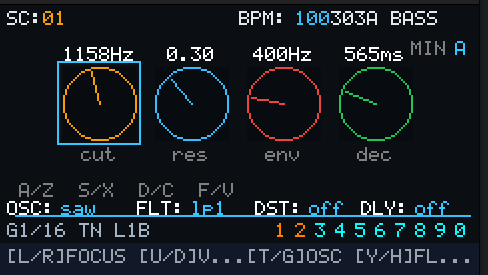
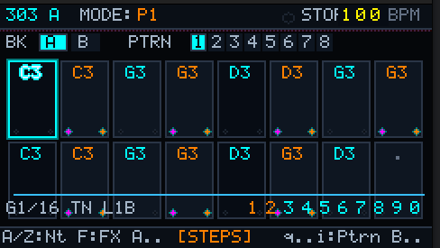
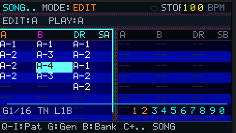

# GroovePuter

[](#current-status)
[](#hardware)
[](LICENSE)

## Generate a groove. Keep what works. Develop it into a song.

**GroovePuter is a pocket composition groovebox for M5Stack Cardputer ADV.**

It generates editable drums, bass, harmony and melody, lets you keep the material you like, and develops related sections instead of solving every musical decision with another unrelated random pattern.

```text
GENERATE
   ↓
KEEP + EDIT
   ↓
DEVELOP
   ↓
SONG / MIDI / external gear
```

GroovePuter works standalone with its internal synths and drums, and can also play or control external MIDI instruments such as Yamaha SEQTRAK.

Originally based on [MiniAcid](https://github.com/urtubia/miniacid); the current project has grown into a substantially larger composition, sequencing, MIDI and musical-material system.

## Start in five minutes

If this is your first session, start with **[`docs/user/QUICKSTART.md`](docs/user/QUICKSTART.md)**.

The first-session key vocabulary is intentionally small:

```text
Space     PLAY / STOP
Fn+M      workspace launcher → GENRE / MATERIAL
G         generate the thing on screen
D         DEVELOP on MATERIAL
Ctrl+Z    undo
Alt+H     help for this page
```

The full expert key map remains available after you have made some music; it is not prerequisite reading.

## Why it is different

### Generate
Genre-aware rhythm, bass, harmonic and melodic material is generated as editable project data, not as an opaque audio result.

### Keep + edit
Accepted material remains yours: it can be edited, arranged, saved, undone and reused rather than disappearing when you ask for another idea.

### Develop
The development workflow is built around a different question from ordinary randomization:

> Given the material I accepted, what may change, what must stay recognizable, and what related section should come next?

## Current status

**v0.9.16 — Foundation Freeze** is the current public hardware-accepted foundation. It freezes the ownership, persistence, MIDI, generation, memory and hardware-validation work that the product now builds on.

The active **0.9.17 — First Five Minutes** line is deliberately narrower. Its job is to make a new owner install GroovePuter, understand the essential controls, create a musical result and recover from mistakes without learning the internal architecture first.

0.9.17 therefore prioritizes:

- first-session documentation and on-device help;
- a stable beginner key vocabulary;
- install / boot / first-sound friction;
- clear musical wording for refusals and preconditions;
- external first-user observation.

It does **not** reopen the Foundation Freeze for speculative musical architecture.

Release: [`v0.9.16 — Foundation Freeze`](https://github.com/Ostrovsky42/GroovePuter/releases/tag/v0.9.16).

## First musical win

The current bounded development gesture is:

```text
CHOOSE DIRECTION
      ↓
MAKE TAKE
      ↓
DEVELOP
```

A truthful first-session path is:

1. `Space` — start playback.
2. `Fn+M` — open the workspace launcher, choose GENRE, then select Genre / Variant / Rhythm.
3. `G` — generate and listen.
4. `Fn+M` — open the workspace launcher and go to MATERIAL.
5. Set `LENGTH = 4B` and `STYLE = REWORK`.
6. `G` — create a fresh TAKE.
7. `D` — develop that fresh TAKE into the supported related development / break cycle.
8. `Ctrl+Z` — undo the retained cycle if you do not want it.
9. Open PROJECT and use the on-screen Save action.

The v0.9.16 foundation still has a legacy `Alt+V` shortcut that resolves to FEEL, so the first-session path deliberately uses the workspace launcher for GENRE until that navigation defect is repaired in a focused 0.9.17 change.

For the complete current key map, see [`src/ui/docs/keys.md`](src/ui/docs/keys.md). On-device page-aware help is available with `Alt+H`.

## Screenshots

| Firmware screen | Preview |
|:---|:---|
| **GENRE** |  |
| **OVERVIEW / SEQUENCER HUB** |  |
| **DRUMS** |  |
| **SYNTH** |  |
| **PATTERN / NOTES** |  |
| **SONG** |  |

## Standalone + MIDI

GroovePuter is **standalone-first, but not standalone-only**.

```text
                         GroovePuter
                              |
          +-------------------+-------------------+
          |                   |                   |
      STANDALONE          COMPANION           DAW / MIDI
          |                   |                   |
 internal synths         external synths       editable material
 drums + Song/Phrase     SEQTRAK / MIDI        routing / recording
 live performance        external keyboard      downstream arrange
```

The musical material remains independent of where sound is produced. A bass or melody idea can belong to GroovePuter even when an external device owns the actual synth voice.

## Hardware

Primary target:

- **M5Stack Cardputer ADV** / ESP32-S3;
- internal display and keyboard;
- DRAM-only product configuration (no PSRAM dependency);
- internal synth and drum engines;
- SD-backed project/material storage;
- USB Device / USB Host MIDI roles supported by the accepted foundation.

Yamaha SEQTRAK is the main external reference device but is optional.

## Building

For development builds:

```bash
bash scripts/install_arduino_deps.sh
bash tests/run_host_tests.sh
bash scripts/build.sh --warnings all
```

Release artifacts and exact acceptance evidence belong to the corresponding GitHub release and release documents; a green arbitrary development build is not automatically a hardware-release claim.

The active GitHub Actions surface is intentionally small:

```text
core.yml
cardputer-adv.yml
midi-targets.yml
memory.yml
release.yml
nightly.yml
research-manual.yml
```

Many more test scripts and research contracts remain behind those entry points. CI surface was reduced; verification depth was not.

## Documentation

Start at [`docs/README.md`](docs/README.md).

Useful direct links:

- [`docs/user/QUICKSTART.md`](docs/user/QUICKSTART.md) — first session;
- [`MANUAL.md`](MANUAL.md) — complete current user workflow manual;
- [`src/ui/docs/keys.md`](src/ui/docs/keys.md) — canonical current key map;
- [`docs/PRODUCT_POSITIONING.md`](docs/PRODUCT_POSITIONING.md) — product boundaries and long-term direction;
- [`docs/releases/`](docs/releases/) — release and hardware-acceptance evidence;
- [`docs/0.9.14/`](docs/0.9.14/) — musical-development research and contracts incorporated into the foundation;
- [`docs/ci/CI_ORCHESTRATION.md`](docs/ci/CI_ORCHESTRATION.md) — CI ownership after productization.

The repository contains a large historical research corpus. Historical stage/checkpoint documents are evidence and design history; they are not automatically descriptions of the current UI.

## Engineering notes

GroovePuter deliberately separates musical identity, realtime timing, persistence and routing. Some recurring architectural rules are:

```text
GENRE != FEEL != SOUND
PREPARE != COMMIT != ACTIVATE
MUSICAL ROLE != MIDI CHANNEL
VERIFICATION DEPTH != CI SURFACE
```

The deeper architecture, semantic research, memory work and hardware acceptance remain public because they are useful engineering evidence — they are simply no longer the first thing a new user should have to understand.

## Contributing

Keep changes narrow, testable and ownership-aware.

- Preserve standalone operation.
- Keep one owner per realtime responsibility.
- Do not add duplicate transport, scheduling or active-note ownership.
- Keep generated material editable.
- Prefer bounded realtime structures and explicit failure behavior.
- Separate research claims from release-accepted behavior.

## Credits

- Original project lineage: [urtubia/miniacid](https://github.com/urtubia/miniacid)
- Hardware: M5Stack Cardputer ADV
- Reference external integration: Yamaha SEQTRAK

## License

MIT — see [`LICENSE`](LICENSE).
