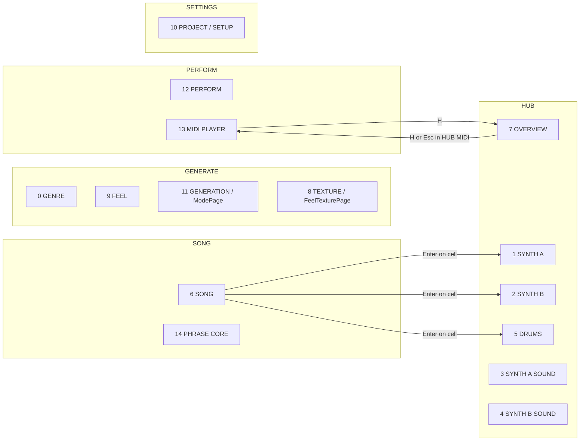

# Audit: функции, ввод и UX ветки `dev`

**Репозиторий:** `Ostrovsky42/GroovePuter`  
**Ветка:** `dev`  
**Анализированный commit:** `98d215372e3c266600f0bc2e10009e373347757c`  
**Дата аудита:** 2026-08-07  
**Scope:** audit-only; production-код не изменялся.

## 1. Executive summary

Главная проблема `dev` — не просто накопившийся dead code. В проекте одновременно существуют несколько пересекающихся пользовательских моделей:

1. page/workflow navigation;
2. pattern page + bank + slot + raw index;
3. генерация из GENRE, отдельной GENERATION-страницы, SONG и локальных редакторов;
4. внутренний transport, SMF transport, external follow и Song mode;
5. Scene, UI session, pattern paging files, SMF route profiles и runtime state как разные persistence domains.

Из-за этого одна функция часто не дублируется буквально, но решает ту же пользовательскую задачу другим способом, с другими клавишами, состоянием и подтверждением.

### Количественная сводка

- активных runtime page id: **15**;
- workflows: **5**;
- строк в сводной keymap-матрице: **77**;
- крупных пользовательских подсистем: **19**;
- групп дублирующейся логики: **12**;
- no-op/UI-unreachable кандидатов: **13**;
- существенных находок: **26**;
  - **P0:** 1;
  - **P1:** 10;
  - **P2:** 14;
  - **P3:** 1.

### Три главных источника регрессий

1. **Разные владельцы одной пользовательской операции.** Генерация одновременно принадлежит отдельной GENERATION-странице и SONG; transport — глобальному слою и MIDI Player; mute — внутренним voices и physical SMF tracks.
2. **Разные persistence domains без общего lifecycle-контракта.** Scene New/Clear не гарантирует очистку pattern paging files; часть изменений FEEL/TEXTURE не проходит через Scene revision.
3. **Контекстная перегрузка клавиш без постоянной индикации слоя.** `Backspace`, `Space`, цифры, `Tab`, `G`, `B`, `X`, `Alt+W` имеют несколько семантик.

## 2. Ограничения и метод

Аудит выполнен статически по GitHub-содержимому `dev` и открытым PR.

Проверено:

- page factory и workflow registry;
- центральный input dispatcher;
- Genre, Feel, Generation, Texture;
- Synth A/B pattern/settings;
- Drums;
- Song и Phrase Core;
- Sequencer Hub и HUB MIDI;
- MIDI Player;
- Perform;
- Project/Setup и MIDI import;
- Tape/Sampler page implementations;
- MANUAL и canonical key map;
- Scene revision/recovery autosave path.

Не выполнено в этой среде:

- PlatformIO/Arduino/SDL build;
- linker map и `nm`;
- Cardputer ADV hardware acceptance;
- фактическая проверка flash/DRAM savings.

Поэтому `TapePage` и `SamplerPage` классифицированы как **UI-unreachable**, но не как гарантированно отсутствующие в бинарнике. Удаление допускается только после build/map проверки.

Машинно-читаемые приложения:

- `docs/audits/dev-keymap-matrix.csv`;
- `docs/audits/dev-feature-inventory.csv`;
- `docs/audits/dev-duplicate-candidates.csv`;
- `docs/audits/dev-unused-symbol-candidates.csv`.

## 3. Runtime page/workflow map

### Исторические aliases в активной factory

- `FeelTexturePage = TexturePage`;
- `SettingsPage = FeelPage`;
- `ModePage = GenerationPage`.

Aliases полезны для совместимости исходников, но в текущем виде скрывают настоящую ownership-карту. Factory и workflow registry должны использовать canonical class names; aliases следует оставить только в compatibility headers.

## 4. Что нужно сохранить

Следующие возможности не являются мусором и не должны исчезнуть из-за cleanup:

- page-first input priority;
- Phrase A/B/C/D и reference-view semantics;
- отдельные internal voice mute и physical SMF track mute models;
- Song copy-on-write generation;
- SMF RAW/safe routing и per-track route profiles;
- external clock/follow;
- Ctrl как практический fallback для selection/fine input на Cardputer;
- скрытая Song Voice data compatibility, пока нет migration-решения;
- Tape DSP/Scene fields даже при решении удалить Tape UI;
- page id 11 compatibility для сохранённой UI session.

## 5. Матрица конфликтов ввода

### `Backspace`

Одновременно означает:

- глобальный Back/previous page;
- clear Song cell/selection;
- clear Phrase slot;
- clear Synth step/selection;
- clear Drum hit/selection;
- с `Alt` — full Song/pattern clear;
- в Project/MIDI browser — cancel/up.

Это наиболее опасная клавиша после New/Clear. Глобальный fallback вызывается только если page не consumed event, но пользователь не видит заранее, будет ли действие навигационным или разрушительным.

### `Space`

- глобальный Groove transport;
- FEEL apply;
- TEXTURE apply;
- MIDI Player play/pause/arm.

Текущий routing технически детерминирован, но пользовательская семантика зависит от страницы. Нужен постоянный status label, а не новая клавиша.

### `1..9` / `0`

- global internal track mute fallback;
- direct page jump с Fn/Alt;
- Perform Tools 1..8;
- Phrase slots 1..4;
- MIDI Player physical-track mute 1..9;
- HUB MIDI physical-track mute 1..9.

Цифровой слой должен быть явно показан на экране: `MUTE`, `PHRASE`, `TOOLS`, `SMF`.

### `Tab`

- смена section/subpage;
- Perform Tools overlay;
- Project section;
- Song clear cell/selection.

`Tab = clear` на SONG — исторический shortcut с плохой discoverability. Не удалять молча: сначала добавить precedence/acceptance tests, затем решить product behavior.

### `G`

- Song cell generation;
- double `G` row generation;
- `Alt+G` selected area;
- `Ctrl+G` generator mode;
- standalone Generation materialization;
- Drum pattern/voice/chaos randomization;
- Project jump to Genre;
- MIDI Player Groove transport/follow;
- Tape loop mute в документации.

Клавиша может остаться общей как «generate/groove», но footer/status обязан показывать scope.

### `B`

На SONG: bank flip, edit Song slot, playback Song slot. В Drums/Synth: bank. В MIDI Player: files/previous panel. Это не прямой конфликт dispatcher, но высокий cognitive load.

## 6. P0/P1 findings

### STORAGE-001 — P0 — New/Clear не владеет всеми pattern files

**Пользовательский эффект:** после New/Clear могут снова появиться старые patterns при смене page/bank; данные разных проектов могут пересекаться.

**Техническая причина:** Scene JSON lifecycle и pattern paging filesystem lifecycle реализованы отдельно.

**Файлы и символы:** `src/ui/pages/project_page.cpp`, pattern paging/storage code, scene storage.

**Как воспроизвести:** создать material на нескольких pattern pages; New/Clear; перейти на ранее использовавшуюся page/bank; проверить старый material и файлы `.gpp/.tmp/.bak`.

**Доказательство:** текущий `ProjectPage::clearProject()` вызывает Scene wipe, а полноценное project-scoped ownership реализуется отдельно в PR #102.

**Уверенность:** высокая.

**Минимальное действие:** завершить и аппаратно принять PR #102; не делать параллельный cleanup этой области.

**Нельзя сломать:** CRC/backup recovery, migration старых `/patterns/page_XX.gpp`, чужие проекты.

### GEN-001 — P1 — Два владельца Song generation

**Пользовательский эффект:** пользователь не понимает, где правильно генерировать материал и почему одинаковая операция имеет разные scope/gesture.

**Техническая причина:** `GenerationPage` materializes Song row, а `SongPage` отдельно реализует cell/row/selection generation.

**Файлы:** `generation_page.cpp`, `song_page.cpp`, `mode_page.h`, workflow/help/docs.

**Как воспроизвести:** сгенерировать row из GENERATION, затем тот же row/cell из SONG; сравнить target selection, RNG/transaction, toast и navigation.

**Уверенность:** высокая.

**Минимальное действие:** PR #101 — SONG становится единственным destination editor; page id 11 остаётся compatibility redirect.

**Нельзя сломать:** atomic row rollback, copy-on-write и persisted page id.

### INPUT-001 — P1 — Backspace смешивает Back и destructive clear

**Пользовательский эффект:** одинаковая физическая клавиша иногда выходит назад, иногда удаляет material.

**Техническая причина:** page-first routing плюс поздний global Back fallback.

**Файлы:** central display dispatcher; Song/Phrase/Synth/Drum/Project handlers.

**Как воспроизвести:** нажать Backspace на каждой странице: без selection, с selection, на pattern row, в dialog.

**Уверенность:** высокая.

**Минимальное действие:** сначала добавить key precedence contract tests и page-aware help; remap делать отдельным UX PR.

**Нельзя сломать:** быстрый clear в редакторах и Esc/dialog cancellation.

### INPUT-002 — P1 — Несколько transport/apply semantics на Space

**Пользовательский эффект:** Space не всегда запускает/останавливает звук.

**Техническая причина:** активная page получает first refusal до global transport.

**Файлы:** central dispatcher, FeelPage, TexturePage, SmfPlayerPage.

**Как воспроизвести:** нажать Space на FEEL, TEXTURE, SONG, MIDI Player в Original/Project/SEQ master modes.

**Уверенность:** высокая.

**Минимальное действие:** постоянный header/footer state `SPACE: APPLY`, `SPACE: GROOVE`, `SPACE: MIDI`; не менять клавишу до tests.

**Нельзя сломать:** SMF arm-next-bar и external follow.

### INPUT-003 — P1 — Цифры имеют четыре разных semantic layers

**Пользовательский эффект:** цифра может mute internal track, выбрать Phrase, изменить Perform tool или mute SMF track.

**Техническая причина:** digit actions находятся на разных уровнях dispatcher и overlays.

**Файлы:** central display, PerformPage, PhrasePage, SmfPlayerPage, HUB MIDI.

**Как воспроизвести:** нажать `1` на Perform normal/tools, Phrase, MIDI Player, Hub и Synth pattern.

**Уверенность:** высокая.

**Минимальное действие:** показывать active digit layer и закрепить precedence tests.

**Нельзя сломать:** прямые page jumps с Fn/Alt и physical SMF mute.

### REV-001 — P1 — FEEL changes могут не поднимать Scene revision

**Пользовательский эффект:** параметр слышимо меняется, но dirty `*`/recovery autosave могут не отражать mutation.

**Техническая причина:** FeelPage пишет `Scene.feel` и применяет timing, но путь не гарантирует `markSceneMutated()`.

**Файлы:** `feel_page.cpp`, `miniacid_engine.cpp`, `scene_revision.h`, display recovery service.

**Как воспроизвести:** изменить FEEL, не выполнять другие mutation, проверить dirty marker; дождаться recovery autosave; reboot/recover.

**Уверенность:** высокая.

**Минимальное действие:** один revision increment на logical apply/adjust; host contract test и hardware recovery test.

**Нельзя сломать:** browsing preset без apply не должен загрязнять Scene.

### REV-002 — P1 — TEXTURE live apply имеет тот же revision gap

**Пользовательский эффект:** texture/FX меняется, но autosave contract может не сработать.

**Техническая причина:** GenreManager setters и live apply обновляют state/DSP, а revision явно отмечается только для части controls.

**Файлы:** `texture_page.cpp`, `genre_manager.h/.cpp`, `miniacid_engine.cpp`.

**Как воспроизвести:** изменить texture mode/amount, ничего больше не менять, проверить dirty/save/recovery.

**Уверенность:** высокая.

**Минимальное действие:** оформить explicit persistent mutation boundary вокруг user commit.

**Нельзя сломать:** preview/browse не должен давать лишние revisions.

### REV-003 — P1 — GENRE apply policy имеет смешанные mutation boundaries

**Пользовательский эффект:** PROFILE ONLY, MATERIALIZE и MATERIALIZE+BPM могут по-разному отражаться в dirty state.

**Техническая причина:** Genre state, Scene materialization, BPM и texture/timbre application проходят разными путями.

**Файлы:** `genre_page.cpp`, `genre_manager.*`, Scene manager/generator paths.

**Как воспроизвести:** выполнить каждый apply policy отдельно на чистой Scene и сравнить revision, generated material, BPM, recovery.

**Уверенность:** средне-высокая; нужен runtime test.

**Минимальное действие:** contract test на каждый policy, затем единая logical mutation transaction.

**Нельзя сломать:** PROFILE ONLY не должен случайно materialize patterns.

### DOC-001 — P1 — TAPE документирован как main page, но не создан factory

**Пользовательский эффект:** manual обещает страницу, до которой пользователь не может добраться.

**Техническая причина:** `TapePage` и большая реализация сохранены, но отсутствуют среди page id 0..14.

**Файлы:** `MANUAL.md`, `src/ui/pages/tape_page.*`, `miniacid_display.cpp`, `ui_config.h`.

**Как воспроизвести:** пройти все workflows/direct pages; Tape не появляется.

**Уверенность:** высокая для UI reachability.

**Минимальное действие:** принять product decision: restore, experimental build-gate или deprecate/remove UI claims.

**Нельзя сломать:** Tape DSP, looper, Scene compatibility.

### DOC-002 — P1 — GENERATION/MODE/Groove Lab/page 11 названы несогласованно

**Пользовательский эффект:** пользователь и разработчик говорят о разных экранах под похожими именами.

**Техническая причина:** historical page id и aliases сохранены без canonical name map.

**Файлы:** workflow registry, global help, key docs, `mode_page.h`, `generation_page.*`.

**Как воспроизвести:** сравнить Alt+V, workflow GENERATE, MANUAL/help и фактический title page 11.

**Уверенность:** высокая.

**Минимальное действие:** после #101 оставить page 11 только compatibility redirect и удалить user-facing ambiguity.

**Нельзя сломать:** старые UI sessions.

### NAV-001 — P1 — Runtime factory использует исторические type names

**Пользовательский эффект:** code review и поиск показывают ложную архитектуру страниц.

**Техническая причина:** active factory создаёт aliases вместо canonical types.

**Файлы:** `miniacid_display.cpp`, aliases headers, `workflow_mode.h`.

**Как воспроизвести:** сопоставить page case, class name, page title и workflow label.

**Уверенность:** высокая.

**Минимальное действие:** canonical types в factory; aliases только compatibility-only.

**Нельзя сломать:** numeric page ids.

## 7. P2/P3 register

| ID | Приоритет | Категория | Доказательство / эффект | Минимальное действие |
|---|---|---|---|---|
| DUP-001 | P2 | numeric adjustment | shared HoldAccelerator и отдельный synth repeat ramp имеют разные thresholds/base steps | configurable policy, миграция по одной page |
| DUP-002 | P2 | wrap/clamp helpers | локальные modulo/while/clamp реализации расходятся | typed helpers только для одинаковой semantics |
| DUP-003 | P2 | pattern identity | Song/Phrase/Generation/selectors/import форматируют identity по-разному | после #102 использовать PatternAddress |
| DUP-004 | P2 | Project handlers | Enter и Left/Right имеют копии switch с разными side effects | локальные row actions до split page |
| ARCH-001 | P2 | God object | ProjectPage владеет storage, setup, LED, MIDI scan/import, Song materialization и postprocessing | сначала pure import/settings helpers |
| ARCH-002 | P2 | input normalization | Project dialogs сравнивают raw scancodes, новые pages используют navCode | normalize at handler boundary + host tests |
| MIDI-001 | P2 | hidden heuristics | filename `hotline/perturbator/disco/909/808/trap/hiphop` меняет import profile/engine | explicit profile; убрать title-specific rules |
| DEAD-001 | P2 | no-op API | MiniAcidDisplay содержит пустые init/draw, false translator и empty state builders | reference/build check, затем pure cleanup |
| DEAD-002 | P2 | test-shaped production | Genre no-op helpers сохранены ради source-regression tests | behavior tests, затем удалить helpers |
| DEAD-003 | P2 | UI-unreachable pages | TapePage и SamplerPage не создаются 15-page factory | restore/build-gate/remove decision + map check |
| STATE-001 | P2 | latent Voice lane | Voice UI disabled, но data копируется/очищается/persists | compatibility/migration decision; не удалять вслепую |
| STATE-002 | P2 | unreachable branch | `cursorOnPlayheadLabel()` всегда false | удалить ветку или реализовать реальный focus |
| THEME-001 | P2 | duplicate user model | global theme и Project VisualStyle экспонируют разные sets | один canonical set, legacy decode-only |
| DOC-003 | P2 | docs drift | Synth Tab/Generator ownership и другие описания отстают от composition | docs из canonical inventory |
| CODE-001 | P3 | cleanup noise | duplicate includes, commented handlers, historical comments | отдельный no-behavior PR после tests |

## 8. Дублирующая логика: что объединять, а что нет

### Объединять

- pattern address conversion/formatting;
- configurable held-key acceleration policy;
- Project setting row adjustment helpers;
- normalized dialog navigation;
- маленькие MIDI note/channel formatters, если flash-neutral;
- canonical page registry/name map.

### Не объединять в один manager

- internal voice mute и physical SMF track mute;
- internal Groove transport и SMF scheduling;
- Pattern randomize и Song materialization;
- Scene Save и SMF route-profile persistence;
- Tape DSP state и Tape UI reachability;
- clamp и wrap operations с разной product semantics.

## 9. Confirmed no-op/UI-unreachable candidates

### High confidence no-op

- `MiniAcidDisplay::initMuteButtons()`;
- `MiniAcidDisplay::initPageHint()`;
- `MiniAcidDisplay::drawMutesSection()`;
- `MiniAcidDisplay::drawPageTitle()` returns `0`;
- `MiniAcidDisplay::translateToApplicationEvent()` returns `false`;
- `MiniAcidDisplay::buildHeaderState()` / `buildFooterState()` return empty states;
- `GenrePage::drawRecipeOverlay()` explicit no-op;
- `SongPage::cursorOnPlayheadLabel()` always false;
- commented Song merge/alternate handlers.

### UI-unreachable, но не доказанный linker dead code

- `TapePage`;
- `SamplerPage`.

### Не считать dead code

- hidden Song Voice data;
- page id 11 compatibility;
- Tape Scene/DSP fields;
- legacy theme decode values;
- compatibility aliases до migration.

## 10. Документация против runtime

| Источник | Заявлено | Runtime `dev` | Решение |
|---|---|---|---|
| `MANUAL.md` | TAPE — main page | factory не создаёт TapePage | restore/deprecate |
| `MANUAL.md` | Generator — generative parameters | page 11 materializes Song row | #101 + docs |
| help/docs | Alt+V/Groove Lab/Generation | один historical page id с alias | canonical label |
| `keys.md` | Synth Tab = Pattern/automation | wrapper содержит Pattern/Settings | исправить composition docs |
| docs | Pattern labels | несколько notations | #102 PatternAddress |
| manual | CARBON/CYBER, AMBER legacy | Project всё ещё циклически экспонирует legacy styles | canonical theme set |

## 11. Реальные workflows

### New Project

До #102 Scene может стать blank, а paging files сохранить старый material. Это P0 и главный blocker для любого cleanup storage.

### Pattern variation → Song

Пользователь вынужден одновременно понимать page, bank, slot, raw index, Song reference, Phrase reference и standalone Generation target. Правильная последовательность упрощения: #102 address model, затем #101 ownership.

### GroovePuter + SEQTRAK

MIDI Player содержит два transports и несколько route/clock states. Эти функции нужны. Упрощение должно идти через постоянный status layer `SRC/STATE/CLK/ROUTE`, а не через удаление external follow или RAW/safe routing.

### Live synth editing

Synth settings уже решает проблему больших диапазонов, но отдельным ramp. Это хороший кандидат на сохранение поведения при переносе в общий configurable policy.

## 12. Рекомендуемая последовательность PR

| Порядок | Scope | Условие |
|---|---|---|
| 1 | завершить existing #102: project-scoped patterns + PatternAddress | hardware acceptance |
| 2 | rebase/завершить existing #101: SONG sole generation destination | учесть #102 address |
| 3 | Scene revision contract для FEEL/TEXTURE/GENRE | host + recovery tests |
| 4 | canonical page registry и compatibility aliases | page ids неизменны |
| 5 | key precedence contract: Backspace/Space/digits/Tab/G/B | сначала tests, без remap |
| 6 | configurable numeric adjustment | Synth → Feel → Texture |
| 7 | ProjectPage extraction и explicit MIDI import profile | после #102 |
| 8 | no-op/dead UI cleanup | build + linker map |
| 9 | Tape/Sampler product decision | hardware/product approval |
| 10 | theme consolidation | legacy decode tests |

Не смешивать cleanup, behavior remap и storage migration в одном PR.

## 13. Hardware assumptions

- M5Stack Cardputer ADV, ESP32-S3, display 240×135;
- primary input — physical QWERTY;
- Shift не должен быть единственным обязательным modifier;
- audio timing, NoteOff lifecycle и SD consistency важнее UI animation;
- input cleanup не должен добавлять full-screen redraw или synchronous scans;
- Scene, UI session, pattern files, SMF route profiles и runtime transport имеют разные lifetime.

## 14. Acceptance checklist

### Input

- [ ] На всех 15 page проверить Esc, Backspace и backtick без selection, с selection и в dialog.
- [ ] Destructive clear никогда не маскируется под Back без page-aware hint.
- [ ] Удержание стрелок на Synth/FEEL/TEXTURE/Project даёт предсказуемое ускорение и не пропускает option values.
- [ ] Цифровой semantic layer явно виден: MUTE/PHRASE/TOOLS/SMF.

### Persistence

- [ ] FEEL/TEXTURE/GENRE logical mutation поднимает dirty ровно один раз.
- [ ] Recovery autosave восстанавливает последнее изменение после reboot.
- [ ] Save очищает dirty.
- [ ] После #102 два проекта не видят pattern pages друг друга.
- [ ] Clear/Delete одного проекта не удаляет файлы другого.

### Transport/MIDI

- [ ] Player Space управляет SMF, G — Groove/follow согласно status.
- [ ] Mute 1..9 и HUB MIDI изменяют один physical-track state.
- [ ] Route edit разрешён только в ожидаемом state и cancel не меняет route.
- [ ] Stop/mute/route/page/panic не оставляет stuck notes.
- [ ] Audio underruns не растут при интенсивной навигации.

### UI/docs

- [ ] `Alt+H`, footer, MANUAL и key map согласованы.
- [ ] Каждая документированная main page достижима или явно deprecated.
- [ ] Pattern identity везде page+bank+slot.
- [ ] Старая UI session с page id 11 открывает compatibility destination.

## 15. Итоговая категоризация

### Keep

Core editors, Song/Phrase, Perform, SMF Player/HUB MIDI, separate mute/transport data models, copy-on-write, route profiles.

### Clarify

Digit layer, Space owner, `G` scope, `B` variants, theme set, Pattern identity, page names.

### Consolidate

Generation destination ownership, numeric adjustment policy, pattern formatter, Project row helpers, dialog navigation.

### Relocate

MIDI import implementation из ProjectPage в pure service/model; user-facing generation destination в SONG.

### Deprecate/decide

Tape UI, Sampler UI, historical aliases, page 11 implementation after compatibility redirect.

### Remove candidates после проверки

MiniAcidDisplay stubs, Genre source-regression no-ops, unreachable Song playhead branch, commented handlers, duplicate includes.

## 16. Audit acceptance

- [x] Production source не изменён.
- [x] Точный SHA записан.
- [x] Runtime page/workflow map восстановлен.
- [x] Keymap и conflict families собраны.
- [x] Existing #101/#102 отделены от новых работ.
- [x] UI-unreachable отделено от linker dead code.
- [ ] Host/SDL/Cardputer builds — требуют отдельного запуска.
- [ ] Linker map / `nm` — требуется до заявления об экономии памяти.
- [ ] Cardputer ADV acceptance — обязательно перед cleanup merge.
