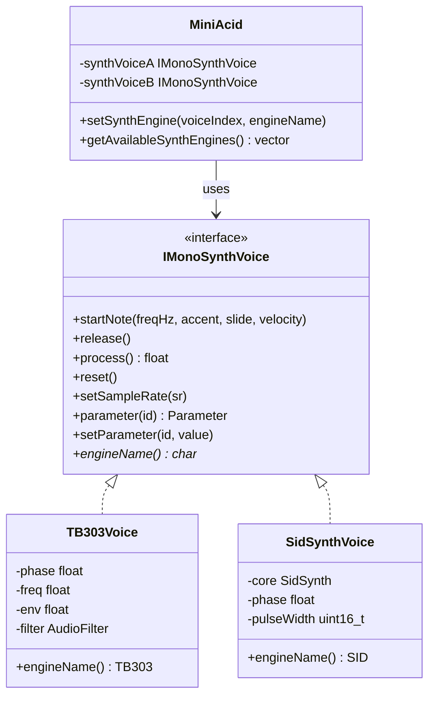

# SID Synthesizer Integration Strategy

## Background

The current uncommitted changes implement SID as a "parasitic" layer that runs parallel to the TB303 Synth A track - it triggers alongside the 303 and has no dedicated sequence. This approach:

- **Wastes CPU**: Both TB303 and SID are processed simultaneously
- **Crowds UI**: Requires a dedicated SID page (Alt+S)
- **Limits sequencing**: SID blindly mirrors Voice A's pattern

## Proposed Architecture: Swappable Synth Engines

Following the established Drum Engine pattern in [`DrumSynthVoice`](src/dsp/mini_drumvoices.h:55), we should introduce a **Synth Engine abstraction**.

### Current State

```cpp
// src/dsp/miniacid_engine.h - hardcoded TB303 instances
TB303Voice voice303;
TB303Voice voice3032;
```

### Proposed State

```cpp
// Abstract interface (similar to DrumSynthVoice)
class IMonoSynthVoice {
public:
    virtual ~IMonoSynthVoice() = default;
    
    // Core synthesis
    virtual void startNote(float freqHz, bool accent, bool slide, uint8_t velocity) = 0;
    virtual void release() = 0;
    virtual float process() = 0;
    
    // Lifecycle
    virtual void reset() = 0;
    virtual void setSampleRate(float sr) = 0;
    
    // Parameters
    virtual const Parameter& parameter(SynthParamId id) const = 0;
    virtual void setParameter(SynthParamId id, float value) = 0;
    
    // Engine identification
    virtual const char* engineName() const = 0;
};

// Engine-specific implementations
class TB303Voice : public IMonoSynthVoice { /* existing code */ };
class SidSynthVoice : public IMonoSynthVoice { /* new SID wrapper */ };
```

### Engine Storage

```cpp
// src/dsp/miniacid_engine.h
std::unique_ptr<IMonoSynthVoice> synthVoiceA_;
std::unique_ptr<IMonoSynthVoice> synthVoiceB_;
std::string synthEngineA_ = "TB303";
std::string synthEngineB_ = "TB303";
```

## Benefits

| Aspect | Current (Parasitic) | Proposed (Swappable) |
|--------|---------------------|----------------------|
| CPU Usage | TB303 + SID always | Only active engine |
| RAM Usage | Both instantiated | One per track |
| UI Pages | Dedicated SID page | Synth Params adapts |
| Sequencing | Mirrors Voice A | Owns its pattern |
| Extensibility | Hardcoded | Easy to add engines |

## Implementation Plan

### Phase 1: Interface Extraction

1. Create `IMonoSynthVoice` interface in [`src/dsp/mono_synth_voice.h`](src/dsp/mono_synth_voice.h)
2. Define common parameter IDs in `SynthParamId` enum
3. Refactor [`TB303Voice`](src/dsp/mini_tb303.h:30) to implement `IMonoSynthVoice`

### Phase 2: SID Voice Implementation

1. Create `SidSynthVoice` class implementing `IMonoSynthVoice`
2. Wrap existing [`SidSynth`](src/dsp/sid_synth.h:9) core
3. Map SID parameters to common interface:
   - Pulse Width → unique SID param
   - Filter Cutoff → common param
   - Filter Resonance → common param
   - Filter Type → unique SID param

### Phase 3: Engine Management

1. Add to [`MiniAcid`](src/dsp/miniacid_engine.h:94):
   ```cpp
   std::vector<std::string> getAvailableSynthEngines() const;
   void setSynthEngine(int voiceIndex, const std::string& engineName);
   std::string currentSynthEngineName(int voiceIndex) const;
   ```
2. Update [`advanceStep()`](src/dsp/miniacid_engine.cpp:1752) to use polymorphic interface
3. Update [`generateAudioBuffer()`](src/dsp/miniacid_engine.cpp:1995) to process through interface

### Phase 4: UI Adaptation

1. Remove dedicated [`SIDPage`](src/ui/pages/sid_page.h)
2. Update Synth Params page to:
   - Query active engine name
   - Show engine-specific parameter labels
   - Add Engine selection option
3. Add engine selection to Groove Lab or Settings

### Phase 5: Scene Storage

1. Add `synthEngineA` and `synthEngineB` to scene JSON
2. Implement save/load in [`SceneStorage`](scene_storage.h)

## Parameter Mapping

### Common Parameters (both engines)

| SynthParamId | TB303 | SID |
|--------------|-------|-----|
| Cutoff | Filter Cutoff | Filter Cutoff |
| Resonance | Filter Res | Filter Res |
| Volume | Output Level | Output Level |

### Engine-Specific Parameters

| TB303 Only | SID Only |
|------------|----------|
| EnvMod | PulseWidth |
| EnvDecay | FilterType |
| Oscillator | Waveform |
| Accent | - |

## Questions for User

1. **Engine Selection Location**: Should synth engine selection be in:
   - Groove Lab (alongside drum engine)?
   - Synth Params page (per-track toggle)?
   - Settings page?

2. ** Default Behavior**: Should new scenes default to:
   - TB303 (current behavior)?
   - Remember last used engine?

3. **Pattern Compatibility**: When switching engines:
   - Keep same pattern (notes map directly)?
   - Offer to convert patterns?

## Architecture Diagram



## Comparison to Drum Engine Pattern

The proposed architecture mirrors the existing drum engine pattern:

| Aspect | Drum Engine | Synth Engine |
|--------|-------------|--------------|
| Interface | `DrumSynthVoice` | `IMonoSynthVoice` |
| Storage | `std::unique_ptr<DrumSynthVoice> drums` | `std::unique_ptr<IMonoSynthVoice> synthVoiceA_` |
| Selection | `setDrumEngine(name)` | `setSynthEngine(index, name)` |
| Engines | 808, 909, 606, CR78, KPR77, SP12 | TB303, SID |
| UI | Genre/Groove Lab | Synth Params |

## Next Steps

1. **User Confirmation**: Does this architectural approach align with expectations?
2. **Interface Design**: Finalize parameter mapping
3. **Implementation Order**: Phase 1-5 as outlined above
